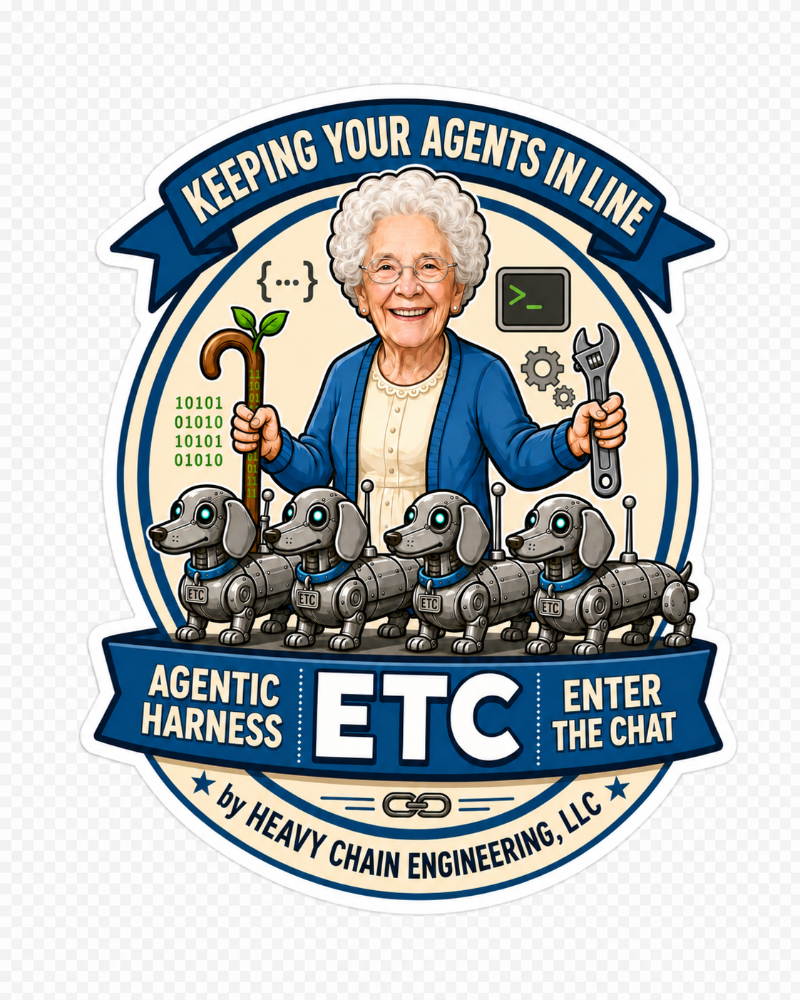

<p align="center">
  
</p>

<h1 align="center">etc</h1>

<p align="center"><strong>/etc — Enter The Chat.</strong><br>An agentic harness that keeps your agents in line.</p>

<p align="center">
  <a href="#quick-start">Quick start</a> ·
  <a href="#what-it-does">What it does</a> ·
  <a href="#skills">Skills</a> ·
  <a href="#languages">Languages</a> ·
  <a href="#why-we-built-it">Why</a> ·
  <a href="RELEASES.md">Releases</a>
</p>

---

## What this is

**etc** encodes how a senior product engineering team works — value hypothesis, domain binding, Socratic specification, test-driven development, recursive decomposition, defense in depth — as Claude Code skills, agents, and enforcement hooks. Install it once and the same disciplines govern work in any repository you point Claude Code at.

It is built by Heavy Chain Engineering for our own client engagements. We share it with selected partners and customers because the same disciplines tend to be useful wherever software is being built under pressure.

Some high-level features:

- **Bootstrap any repo with `/init-project`** — turns greenfield OR brownfield into a harness-ready state in one pass: technical scaffold, interactive DOMAIN.md, tiered docs skeleton, starter role manifests. Idempotent.
- **Deep system archaeology with `/discovery`** — multi-source investigation across code, data, Salesforce orgs, and infra. Surfaces what is *actually* happening — not what the docs claim, not what the diagrams show. Built for migrations, due diligence, and brownfields whose documentation has drifted from reality.
- **Socratic specification with a three-state classifier** — `/spec` interviews until it can write a buildable PRD; classifies the result (well-specified / research-assisted / rejected); refuses to draft from vague input.
- **SME-led MVP definition** — domain experts capture real work via `/journey` in plain English; the intersection of journeys IS the MVP.
- **Parallel research at every intake** — LSP-anchored navigation (definitions, references, call graphs) where the query is symbolic; grep where the query is textual; plus web fetch and antipatterns lookup. All run in parallel before drafting begins. Findings cite source files, URLs, or ADRs.
- **Recursive work-breakdown decomposition** — `/build` scores every task and recurses until each leaf is small enough to dispatch (score ≤ 7 on the WBS scale). Arbitrarily large problems land as arbitrarily deep trees.
- **Phase → wave → task execution hierarchy** — `/build` groups waves into phases derived from the top-level work-breakdown (a flat feature collapses to one phase, zero-regression); progress, resumability, and timing are tracked at phase *and* wave granularity via additive nested git tags.
- **Wave planning with cross-feature collision detection** — parallel-safe dispatch by file-set isolation; overlaps with other in-flight features caught at plan time, not at merge time.
- **Stacked-PR delivery** — multi-wave builds emit one squash commit per wave on a stacked branch chain (~500 LOC per layer), so review can keep up with agentic throughput.
- **Mechanical TDD enforcement** — a PreToolUse hook blocks edits to production code without a sibling test. No exemption flag.
- **Multi-language profile enforcement** — Python, TypeScript, Go, and Rust get test / types / lint / TDD gates today via the F020 profile architecture; new languages copy an eight-file pattern.
- **Adversarial spec verification** — every shipped task is reviewed against the original PRD by a spec-enforcer agent before the release tag is written.
- **Defense in depth** — bug classes are defended at three independent SDLC phases. Three gates must fail simultaneously for recurrence.
- **Outcome tracking by value hypothesis** — every feature carries a `value-hypothesis.yaml`; `/metrics` reports the percentage validated, broken down by author role. Anti-Goodhart by construction because the harness writes the source data automatically.
- **Closed-loop intake via Linear MCP** — `/pull-tickets` pulls tickets, generates PRDs from ticket content + codebase research, builds successful ones, returns rejects with clarifying questions in the source tool.
- **Hotfix → postmortem → antipattern pipeline** — incidents close with a prevention rule that every future `/spec` invocation on the same project automatically incorporates.
- **Append-only git-tag audit trail** — phase boundaries marked mechanically (`etc/feature/F<NNN>/{spec,architect/done,build/phase-N/done,release}`); `/metrics` derives process metrics from the tags without manual logging.
- **Output IS state** — every skill writes findings to disk continuously. Sessions die, contexts compact, work resumes exactly where it stopped.
- *etc.*


---

## Quick start

```bash
git clone <repo-url> && cd etc-system-engineering

# compile your SDLC YAML → dist/
python3 compile-sdlc.py spec/etc_sdlc.yaml

# merge hooks + copy skills
./install.sh --client claude --scope global 
# Restart Claude Code. The harness is active.
```

Three commands. The compile is sub-second; the install merges hooks into `~/.claude/settings.json` and copies skills, agents, and standards into place.

**Warning**: This writes directly to your claude code. It is recommended that you back up your claude code before installing.

### Try it

In any project, open Claude Code and type:

```
/spec "Add user authentication"
```

You will get six Socratic questions, parallel codebase + web research, a three-state classification verdict, and a section-by-section PRD draft with per-section approval. Output lands in `.etc_sdlc/features/F<NNN>-add-user-authentication/`.

Then try editing a `src/` file without a sibling test. The TDD hook will block the edit and tell you why. That is the harness working.

---

## What it does

A senior engineering team is mostly a set of disciplines: spec what you build, test before you ship, decompose work that exceeds one head, review what passed adversarially, measure the outcome. Junior teams know the words but lose the disciplines under pressure. AI agents on a long task drift the same way — only faster and with less self-awareness.

etc closes the loop:

| Discipline | How etc keeps it |
|---|---|
| **Specify before you build** | `/spec` runs a Socratic interview, classifies the result, refuses vague input. |
| **Architect before you implement** | `/architect` is a separate phase that produces a `design.md` plus ADRs. |
| **Test before you write** | A PreToolUse hook blocks edits to production code without a sibling test. |
| **Decompose before you dispatch** | `/build` scores every task and recurses until each leaf scores ≤ 7 on the WBS scale. |
| **Verify adversarially** | A spec-enforcer agent reviews every shipped task against the original PRD. |
| **Measure the outcome** | Each feature writes a `value-hypothesis.yaml`; `/metrics` reports % validated by author role. |
| **Never lose session state** | A `PreCompact` hook auto-checkpoints `.etc_sdlc/checkpoint.md` before every `/compact` (manual or auto), preserving a fresher model-written checkpoint if one exists. |
| **Defend in depth** | When a bug escapes, the fix is layered enforcement at three independent SDLC phases — never a single patch. |

The harness does not replace your engineers. It makes their disciplines mechanical.

---

## The lifecycle

```
    strategy
        │
        ▼
    research
        │
        ▼
(design │ strategy) ◄──────────┐
        │                      │
        ▼                      │
      spec                     │
        │                      │
        ▼  reflect (continuous)│
    architect                  │
        │                      │
        ▼                      │
      build                    │
        │                      │
        ▼                      │
     release ──────────────────┘
```

| Phase | What you get | Skill |
|---|---|---|
| **Discover** *(optional, brownfield)* | system portrait, dependency map, complexity assessment | `/discovery` |
| **Roadmap** *(optional, strategic)* | phased plan with entry/exit criteria | `/roadmap` |
| **Journey** *(optional, SME-led)* | journey artifacts at `docs/mvp/journeys/J-NNN-*.md` | `/journey` |
| **Design** | `PRODUCT.md`, `DESIGN.md`, design tokens, component specs | `/design` (wraps [pbakaus/impeccable](https://github.com/pbakaus/impeccable)) |
| **Spec** | `spec.md` + ACs + edge cases + value hypothesis | `/spec` |
| **Architect** | `design.md` + ADRs | `/architect` |
| **Build** | working code, green tests, audit trail, release tag | `/build` |
| **Reflect** | turn-by-turn engagement data, evidence-cited proposals | `/efficiency` |
| **Clean** *(autonomous, background)* | flawless-only cleanup PRs from an isolated worktree, never touching your tree | `/janitor` |
| **Maintain** | hotfix incidents, postmortems, prevention rules | `/hotfix`, `/postmortem` |

---

## Skills

Skills are slash commands. Each lives at `skills/<name>/SKILL.md`. Highlights:

| Skill | For | What it does |
|---|---|---|
| `/spec` | PMs, SMEs | Six-question Socratic loop + parallel research + three-state classifier + section-by-section drafting. Auto-detects engineering implications and offers to chain `/architect`. |
| `/architect` | Architects | Mirrors `/spec`'s shape for architecture: phases, classifier, gray-area resolution, ADR emission. |
| `/build` | Engineers | The conductor. Eight steps from spec to verified working code. Resumable via `/build --resume`. Multi-wave builds emit stacked PRs via gh-stack. `--autonomous` wraps Anthropic's `/goal`. |
| `/journey` | SMEs | Plain-English capture of how real work gets done. Six warm questions, zero engineering jargon. Output feeds `/spec`. |
| `/design` | Designers | Wraps [pbakaus/impeccable](https://github.com/pbakaus/impeccable) for Socratic design-context capture, then emits Google's [DESIGN.md spec](https://github.com/google-labs-code/design.md). |
| `/discovery` | New on a brownfield | Reads code, data, git history, infra. Tells you what the system *is*, not what the docs claim it is. |
| `/roadmap` | Leaders setting direction | Five-phase interrogation, then a phased roadmap with entry/exit criteria. |
| `/hotfix` | Production on fire | Incident lane that bypasses some development gates at the manifest layer; safety guardrails and invariants still fire. |
| `/postmortem` | After every escape | Traces root cause, appends a prevention rule to `.etc_sdlc/antipatterns.md`. |
| `/efficiency` | Daily reflection | Captures every turn end, computes active engagement, writes evidence-cited proposals only. |
| `/janitor` | Autonomous cleanup | Boy-Scout-rule background cleanup. Surveys the repo, fixes flawless-only categories (lint/format, test-proven dead-code, whitespace/imports) in an **isolated git worktree off `main`**, verifies, runs a mechanical pre-PR boundary check, and opens a PR — never touches your working tree. `/janitor` (interactive) or `/janitor --autonomous` (hands-off). Per-category graduated trust: preview draft-PR → autonomous ready-PR after N clean merges. Janitor submits; a human merges. |
| `/metrics` | Weekly review | Three-layer report: process (git tags), outcome (`value-hypothesis.yaml`), cost (telemetry). Headline metric is **% hypothesis-validated**, broken down by author role. |
| `/pull-tickets` | Closed-loop intake | Pulls Linear tickets via MCP, generates PRDs, runs `/build`, or returns the ticket with clarifying questions. |
| `/init-project` | Bootstrapping a repo | Creates `DOMAIN.md`, `PROJECT.md`, `CLAUDE.md`, role manifests. Idempotent. |

Plus `/decompose`, `/implement`, `/tasks`, `/checkpoint`, `/retrospective`, `/harness-feedback`. Read `skills/<name>/SKILL.md` for the full contract on each.

---

## Languages

Four languages get first-class enforcement today via the F020 profile architecture. The other major stacks get the agent layer and `/init-project`, plus a clean WARN-skip on every unsupported file (no silent gaps).

| Language | Tests | Types | Lint | TDD gate | Code quality |
|---|---|---|---|---|---|
| **Python** | `uv run pytest --cov` | `mypy` | `ruff` | sibling `tests/test_<mod>.py` | mutable globals + no-op functions (AST) |
| **TypeScript** | `npm test` | `tsc --noEmit` | `eslint` | sibling `*.test.ts` / `*.spec.ts` | empty function bodies |
| **Go** | `go test ./...` | `go vet ./...` | `gofmt -l` + `golangci-lint` | sibling `_test.go` | empty function bodies |
| **Rust** | `cargo test --workspace` | `cargo clippy -- -D warnings` | `cargo fmt --check` | in-file `#[cfg(test)]` or `tests/<mod>.rs` | empty bodies + `.unwrap()` outside tests |

Adding a profile is a copy-the-pattern exercise — each profile is eight files under `standards/code/profiles/<lang>/` (detection, README, three rule-bindings, three gate scripts). Bindings cite community-canonical style guides; etc never authors its own.

**Not yet:** Java, Swift, Ruby, Terraform, Kubernetes, Markdown. The profile architecture supports them; per-language content is on the queue. See [RELEASES.md](RELEASES.md) for the F020/F021 history.

---

## Why we built it

A handful of ideas hold the harness together. These are the principles you will keep meeting.

### Output IS state

Skills write findings, decisions, and progress to disk *continuously* rather than holding them in agent context. Sessions die. Blockers pause work for hours. Context windows compact. A resume picks up exactly where it stopped because the artifacts ARE the state. Real client investigations span hours or days; access is fragmented; the agent that started the work is rarely the agent that finishes it.

### The three-state classifier

`/spec` does not blindly accept every input. After parallel research, it classifies the input into:

- **Well-specified** — proceed straight to drafting.
- **Research-assisted** — codebase or web research filled the gaps with citations; user reviews fills during section approval.
- **Rejected** — too many unfillable gaps; `rejected.md` is written with specific questions; `spec.md` is *not* written.

This saves agent-hours on under-specified inputs. A vague one-liner that would have produced a vague PRD now produces a rejection report with the questions the human needs to answer first. The same classifier runs again in `/architect`.

### Outcome metrics, not just outputs

Every `/spec`-produced feature carries a `value-hypothesis.yaml` predicting what success looks like — `who`, `current_cost`, `predicted`, `how_we_know`. `/metrics` reads those hypotheses, the per-project telemetry DB, and the git lifecycle tags, and reports whether the prediction held.

We build features that do not move the needle all the time. The harness makes that structurally visible.

### Defense in depth

When a class of bug escapes, the response is layered enforcement at multiple SDLC phases — never a single fix. F001 (spec-time), F002 (verify-time), and F003 (dispatch-time) defend the same root cause at three independent gates. Three independent gates have to fail for the bug class to recur.

### Forward-only

New rules apply to new artifacts. Legacy specs are never silently rewritten. Turnaround engagements often involve large bodies of historical work that we cannot afford to invalidate.

### Source of truth + compile model

Everything flows from `spec/etc_sdlc.yaml`. The compiled `dist/` tree is regenerated from that file by `compile-sdlc.py`; never edit `dist/` directly. Edits to skills, agents, standards, or hooks happen in their source files; one compile-and-install cycle deploys the change.

---

## What ships with it

| Layer | What | Where |
|---|---|---|
| **Skills** | 20 workflows | `skills/<name>/SKILL.md` |
| **Agents** | 26 role specialists | `agents/<name>.md` |
| **Standards** | Engineering rules every role inherits | `standards/<category>/*.md` |
| **Hooks** | Mechanical enforcement on Claude Code lifecycle events | `hooks/*.sh` |
| **Scripts** | Python helpers for tags, tasks, telemetry, value hypotheses | `scripts/*.py` |

A skill calls an agent. An agent reads the standards. A hook blocks the agent if the standard is violated. The combination produces senior-team discipline in a codebase that does not yet have one.

---

## Repository structure

```
agents/                 26 role definitions (one .md per role)
skills/                 20 slash-command workflows (one subdir per skill)
standards/              engineering rules (process/, code/, testing/, …)
hooks/                  bash scripts on Claude Code lifecycle events
scripts/                python helpers (feature_id, value_hypothesis, …)
spec/etc_sdlc.yaml      THE master config — single source of truth
dist/                   compiled output. do not hand-edit.
tests/                  ~1000 contract tests, pytest, ~60s
compile-sdlc.py         YAML → dist/
install.sh              dist/ → ~/.claude/ + settings.json merge
assets/                 brand assets including the logo
```

Per-feature work lands under `.etc_sdlc/features/F<NNN>-<slug>/` — gitignored in client repos by default; durable on the developer's machine. The release tag and `release-notes.md` are what ships back, not the full directory. In this repo, feature directories *are* committed because etc's own work is the source of truth for its audit trail.

---

## Configuration

**Editing the harness.** Edit `spec/etc_sdlc.yaml` (or a file it references), then `python3 compile-sdlc.py spec/etc_sdlc.yaml && ./install.sh`. Restart Claude Code. Make this muscle memory.

**Install scope.** `./install.sh --scope project` installs into `./.claude/` instead of `~/.claude/`, so etc's hooks only fire in that project's Claude Code sessions. Useful when you want a different harness on a different project.

**Model overrides.** Each skill, agent, or hook can specify its own model in the YAML. Defaults: sonnet for judgment-bearing gates, haiku for mechanical command hooks, opus for the strongest verification (final `/build` Step 7 review). Never hardcode a model in a skill body — model choice belongs in the YAML.

---

## A note to partners and customers

If you are reading this because Heavy Chain Engineering has invited you in: welcome.

The harness is internal in the sense that we built it for ourselves. It is not secret. It encodes how we work — disciplines learned the hard way over many turnaround engagements — and the parts that are mechanically enforceable are enforced. We share it with selected partners and customers because the same disciplines tend to be useful wherever software is being built under pressure.

If something in the harness contradicts how your team works, that is a real conversation to have. We are not trying to impose a process; we are trying to make a known-good process portable. The skills, agents, and standards are all editable. The compile-and-install loop is fast. Adapt where you need to. But adapt deliberately, and read the standards first — most of what looks arbitrary is load-bearing.

---

## Where to learn more

In rough order of value per minute spent:

| Read | When |
|---|---|
| `standards/process/sdlc-phases.md` | First. The harness's playbook. |
| `standards/process/interactive-user-input.md` | Before writing or modifying any skill. Pattern A vs Pattern B is load-bearing. |
| `skills/spec/SKILL.md` | Socratic loop in full detail. |
| `skills/build/SKILL.md` | Conductor in full detail. |
| `agents/sem.md` | The orchestrator's responsibility chart. |
| `compile-sdlc.py` | Heavily commented. Source → compile → install lifecycle. |
| `RELEASES.md` | What has shipped and when. |
| `.etc_sdlc/features/F006-spec-architect-split/spec.md` | A real shipped PRD, written by `/spec`. The shape every spec converges to. |

The skills, agents, and standards are all plain markdown. They are meant to be read.

---

<p align="center"><em>The kind of engineering this codifies: tests-first because tests are the specification; specifications written under cross-examination because vague intent produces vague code; decompositions that go as deep as the problem requires; outcomes measured because shipping is not the same as moving the needle; and defense in depth because every shipped bug is a failure of multiple gates simultaneously, and the response is to add gates.</em></p>

<p align="center"><strong>Built by <a href="https://heavychain.engineering">Heavy Chain Engineering, LLC</a>.</strong></p>

<p align="center"><sub><em>The illustration of <strong>Etsy</strong> is adapted from Jason's great aunt Etsy. She was a wonderful woman.</em></sub></p>
